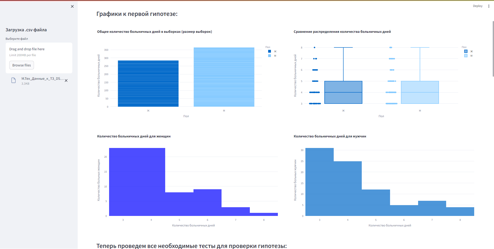

# Техническое задание на вакансию Младший исследователь данных(DS) в М.Тех.
[Дэшборд](Shevnin_Dmitriy_intern_DS.py) находится в файле Shevnin_Dmitriy_intern_DS.py, а [jupyter-notebook](Shevnin_Dmitriy_intern_DS.ipynb) с логикой выполнения задания, статистическими тестами, выводами, кодом и графиками в файле Shevnin_Dmitriy_intern_DS.ipynb.

Исходя из данных в [датасете](М.Тех_Данные_к_ТЗ_DS.csv) проверить две гипотезы: мужчины пропускают в течение года более 2 рабочих дней по болезни значимо чаще женщин и работники старше 35 лет пропускают в течение года более 2 рабочих дней по болезни значимо чаще своих более молодых коллег.

Для проверки гипотез выполнена проверка на нормальность данных с помощью теста Шапиро–Уилка, затем выполнен u-тест Манна-Уитни для проверки выборок на статистически значимые различия, а также t-тест Стьюдента (хотя его не рекомендуется применять на ненормально распределенных выборках, но в нашем случае разночтений между ним и u-тестом не было).

Для интерактивной визуализации результатов была использована библиотека Plotly, а также создан интерактивный дэшборд с возможностью загружать файл для анализа с помощью библиотеки Streamlit.

Для использования дэшборда необходимо выполнить в терминале команду streamlit run <path to file>/main.py, после чего в браузере откроется новая вкладка с запущенным на локальной машине сервером.

Внешний вид дэшборда:

